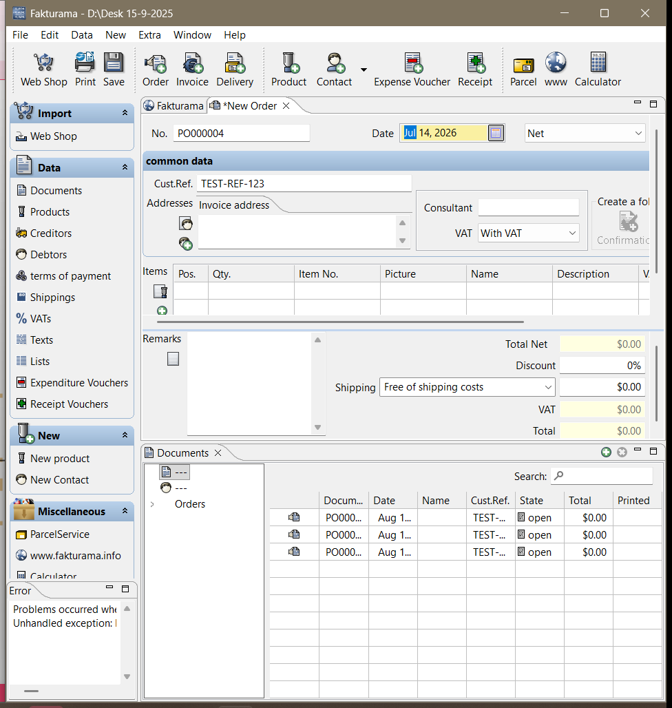

# Runtime Evidence

The following screenshots document the successful Order workflow executed with the task-provided image, `samples/order_input.png`.

## 1. New Order and completed header

The screenshot shows the newly opened Order, generated Order number, customer reference `WEB-2026-0714-A17`, Order date `2026-07-14`, Net price mode, With VAT mode, and the selected existing Debtor for Northstar Office GmbH.

## 2. Exact Product selection

The Product selector shows the required SKU row selected before the automation confirms the selection.

## 3. Completed Fakturama Order items and totals

The Fakturama Order contains both source items:

- `CHR-ERG-01`: quantity `2.00`, unit net `250.00`, VAT `19%`, discount `10.00%`, line net `450.00`.
- `MAT-DESK-02`: quantity `3.00`, unit net `40.00`, VAT `19%`, discount `0.00%`, line net `120.00`.

The displayed totals are Total Net `570.00`, VAT `108.30`, and Total `678.30`.
## 4. Persisted Order verification

The Documents view verifies the saved Order using its document number, date, customer reference, open state, and total.

## Validation scope

The desktop workflow was tested only with the single task-provided image. These screenshots do not demonstrate performance on other document layouts or image conditions.
