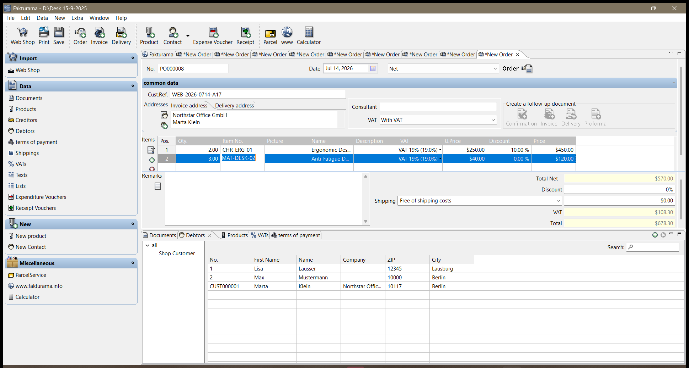
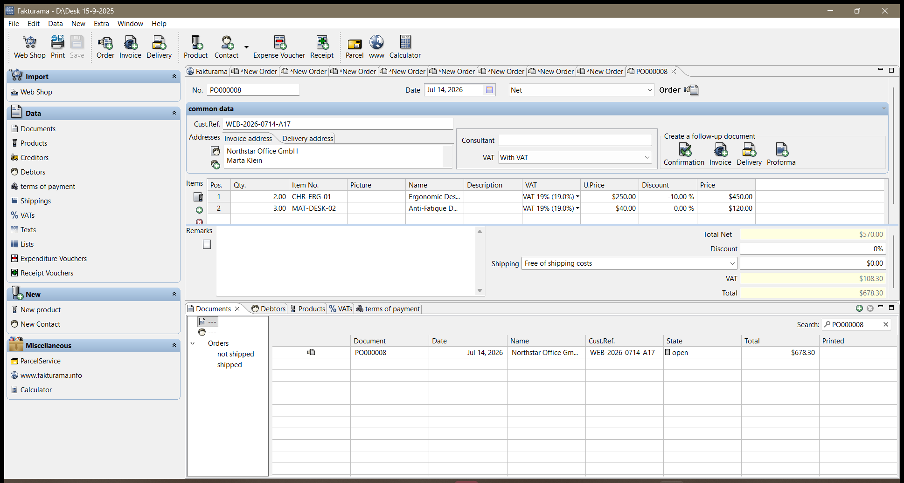
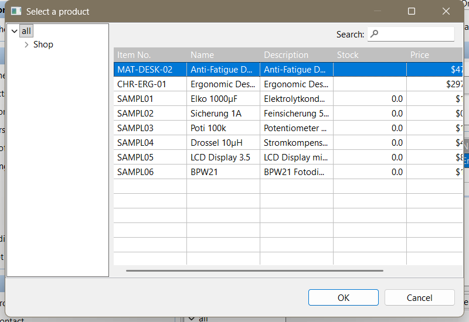

# Runtime Evidence

This page embeds the selected Fakturama screenshots and explains what each one demonstrates. GitHub will display the PNG files directly below when they exist at the referenced paths. Regenerate and review the files from the final run before publishing the repository.

## 1. Verified Order lines and totals

The Order Items table should show exactly two source lines:

- `CHR-ERG-01`: quantity `2.00`, unit net `250.00`, VAT `19%`, discount `10.00%`, line net `450.00`.
- `MAT-DESK-02`: quantity `3.00`, unit net `40.00`, VAT `19%`, discount `0.00%`, line net `120.00`.

The totals area should show Total Net `570.00`, VAT `108.30`, and Total `678.30`.

## 2. Persisted Order in Data > Documents

The filtered Documents row is used to verify the generated Order number, `2026-07-14` date, `WEB-2026-0714-A17` customer reference, open state, and `678.30` total. Tesseract may render `PO000008` as `0000008`; the automation accepts that known document-number transformation only when the remaining row fields also match.

## 3. Exact Product-row selection

The Product selector evidence must show the exact required SKU row visibly selected before **OK** is clicked. The automation rejects selection when focus remains on the left-side `all` tree node.

## Validation scope

These screenshots come from the single task-provided image, `samples/order_input.png`. They do not demonstrate performance on other document layouts or image conditions.

## Privacy review

Before publishing publicly, confirm that these images contain only the supplied sample data. Remove or redact screenshots showing unrelated customers, documents, local usernames, private directories, or other desktop content.
